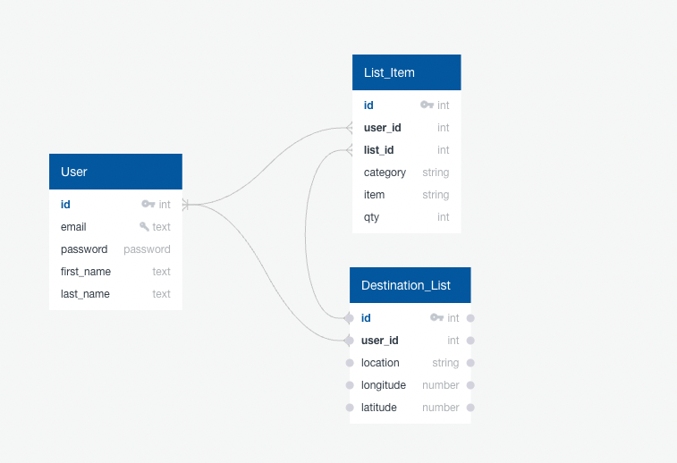

# Capstone Two

### Backend - API and Database Schema

When planning for a trip, travelers often struggle to pack for destinations when they aren't familiar with the location's climate. Also most people over-pack for trips, not knowing how many articles of clothing they actually need. The goal of packable is to take the guesswork out of the packing experience. By pulling for a locations past weather data, a user can enter their trip dates and destination, and see likely weather conditions for when they will be there. Further, the app will generate a template packing list based on the number of days the user will be traveling and the climate of their destination. The packing list can then be edited and saved to there user profile. 

------

#### Packable API

Packable has it's own RESTful API using a PostgreSQL database, Node.js and Express to store and access user and list data. The Packable API handles requests from the frontend and uses SQL queries to interact with the PostgreSQL database, retrieving and updating data as needed. The API then returns the data to the frontend in JSON which the frontend can then use to update the UI.

#### Visual Crossing API

Packable uses the [Timeline Weather API from Visual Crossing](https://www.visualcrossing.com/resources/documentation/weather-api/weather-api-documentation/) for it's forcast feauture of the packing lists. The Timeline API lets the app retrieve predected forcast data based on historical observations, current 15-day forecasts, and statistical weather forecasts. 

**Example http request for future probably forcast in New York, NY**:

`https://weather.visualcrossing.com/VisualCrossingWebServices/rest/services/timeline/new%20york%2C%20ny/2023-05-25/2023-05-27?unitGroup=us&key=[API Key]&contentType=json`

##### Returned JSON Data

```json
{
   "queryCost": 3,
   "latitude": 40.7146,
   "longitude": -74.0071,
   "resolvedAddress": "New York, NY, United States",
   "address": "new york, ny",
   "timezone": "America/New_York",
   "tzoffset": -4,
   "days": [
      {
       "datetime": "2023-05-25",
       "datetimeEpoch": 1684987200,
       "tempmax": 72.9,
       "tempmin": 57.5,
       "temp": 65,
       "feelslikemax": 0,
       "feelslikemin": 0,
       "feelslike": 83.2,
       ...
      },
      {
        "datetime": "2023-05-26",
        "datetimeEpoch": 1685073600,
        "tempmax": 75.1,
        "tempmin": 60.3,
        "temp": 67.2,
        "feelslikemax": 0.0,
        "feelslikemin": 0.0,
        "feelslike": 86.4,
        ...
      },
      {
        "datetime": "2023-05-27",
        "datetimeEpoch": 1685160000,
        "tempmax": 77.4,
        "tempmin": 60.9,
        "temp": 68.1,
        "feelslikemax": 0.0,
        "feelslikemin": 0.0,
        "feelslike": 83.9,
        ...
      }
   ]

```

------

#### Database Schema



##### Database schema located in /database/schema.sql

```sql
CREATE TABLE users (
    id SERIAL PRIMARY KEY,
    username VARCHAR(25),
   password TEXT NOT NULL,
    first_name TEXT NOT NULL,
    last_name TEXT NOT NULL,
    email TEXT NOT NULL CHECK (position('@' IN email) > 1),
);

CREATE TABLE destination_lists (
    id SERIAL PRIMARY KEY,
    user_id int NOT NULL REFERENCES users ON DELETE CASCADE,
    searched_address TEXT NOT NULL,
    longitude NUMBER NOT NULL,
    latitude NUMBER NOT NULL,
    arrival_date DATE NOT NULL,
    departure_date DATE NOT NULL,
);

CREATE TABLE list_items (
    id SERIAL PRIMARY KEY,
    list_id int NOT NULL REFERENCES destination_lists ON DELETE CASCADE,
    category TEXT NOT NULL,
    item TEXT NOT NULL,
    qty int NOT NULL,
);
```

------

#### User Flow


------

#### Security

User accounts with hashed passwords will allow users to save location searches and associated packing lists they create for trips. 

Passwords are hashed and authenticated using Bcrypt so only hashed passwords are stored in the database.

JSON Web Tokens are used to encode and store logged in user data:

1. When a user logs in or registers, their username and password are verified using bcrypt and a JSON Web Token is generated and returned to the frontend.
2. The frontend receives the token and stores it in local storage.
3. When the frontend makes requests to the server, the server checks for the token in storage, decodes and extracts the user data required to authorize access.

**Only logged in users can:**

* Add new lists
* Search locations with planned travel dates
* Generate packing list based on travel location and climate
* Add, update and save packing lists and location searches

------

#### Improvements to be made

All restful API points work for users, lists and list items but not all are implemented in the front end.

**End points not implemented yet:**

* Edit / PATCH an existing list
* Edit / PATCH an existing user
* Remove / DELETE an existing user
* GET / POST / PATCH / DELETE a list item (all list items are being managed in state on the client side)

Authentication for removing (DELETE) a list currently allows any user to delete any list. Need to find a clean way of checking all user lists on backend and ensuring list being accessed is owned by currently logged in user. 

List items are currently all being added, updated, and removed on the frontend and not connected to database. The way the current frontend is structured, API calls will have to be made with each list item edit as well as each addition and deletion to list. 

JSON Schema validation still needs to be added for all POST and PATCH requests to users, lists and list items. 
